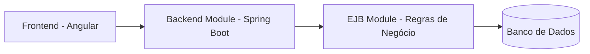

# Gestão de Benefícios

## 🗂️ Índice

- [📌 Resumo](#-resumo)
- [🏗️ Descrição do Desafio](#️-descrição-do-desafio)
- [📁 Estrutura do Projeto](#-estrutura-do-projeto)
- [🧩 Arquitetura do Sistema](#-arquitetura-do-sistema)
- [🛠️ Instalação do Projeto](#️-instalação-do-projeto)
- [⚙️ Configuração de Ambiente](#️-configuração-de-ambiente)
- [☕ Módulos do Projeto](#-módulos-do-projeto)

## 📌 Resumo

O Gestão de Benefícios é um sistema desenvolvido para controlar, gerenciar e realizar a transferência de valores entre diferentes tipos de benefícios. A plataforma foi projetada para ser operada de forma centralizada pelo departamento de Recursos Humanos (RH), facilitando a distribuição para os funcionários.


## 🏗️ Descrição do Desafio

A descrição original do desafio pode ser acessada aqui: [Documentação do desafio](docs/README.md).


## 📁 Estrutura do Projeto

```text
desafio_bip/
├── backend-module/
├── ejb-module/
├── frontend/
│   └── beneficio-web/
├── docs/
└── db/
```

  
## 🧩 Arquitetura do Sistema



O sistema é composto por três camadas principais:

- Frontend em Angular, responsável pela interface do usuário
- Backend em Spring Boot, responsável pelas APIs e controle da aplicação
- Módulo EJB, responsável pelas regras de negócio internas
- Banco de dados para persistência das informações

O `ejb-module` não é executado diretamente, sendo utilizado como dependência interna ao `backend-module`.

## 🛠️ Instalação do Projeto

Antes de clonar o projeto, instale as dependências abaixo:

### Pré-requisitos
 - [Java 17](https://www.oracle.com/java/technologies/javase/jdk17-archive-downloads.html)
 - [Maven 3.9.12](https://maven.apache.org/docs/3.9.12/release-notes.html)
 - [Node.js 24.15.0 LTS](https://nodejs.org/en/download)

Após instalar o Node.js, instale o Angular CLI globalmente:

```bash
npm install -g @angular/cli@21.2.7 
```
---

### Clonar o projeto

```bash
git clone https://github.com/DarleyGC2016/desafio_bip.git
```
---

### Build do Backend

Abra o terminal na raiz do projeto e execute:

```bash
mvn clean package
```
---

### Configuração do Frontend

Acesse a pasta do **[Frontend](frontend/README.md)**, no terminal use esse comando:

```bash
cd frontend/beneficio-web
```

Instale as dependências:

```bash
npm install
```


## ⚙️ Configuração de Ambiente

Para configurar o ambiente no Windows(10 ou 11):

### Maven

Crie uma variável:

```text 
Nome de variável:  M2_HOME
Diretório: caminho da pasta do Maven
Adicionar ao PATH: %M2_HOME%\bin
```

### Java

Crie uma variável de ambiente:

```text
Nome de variável:  JAVA_HOME
Diretório: C:\Program Files\Java\jdk-17
Adicionar ao PATH: %JAVA_HOME%\bin
```

## ☕ Módulos do Projeto

Neste projeto existem dois módulos principais: [backend-module](backend-module/README.md) e  [ejb-module](ejb-module/README.md)

Estrutura declarada no pom.xml: 

```xml
<modules>
  <module>ejb-module</module>
  <module>backend-module</module>
</modules>
```