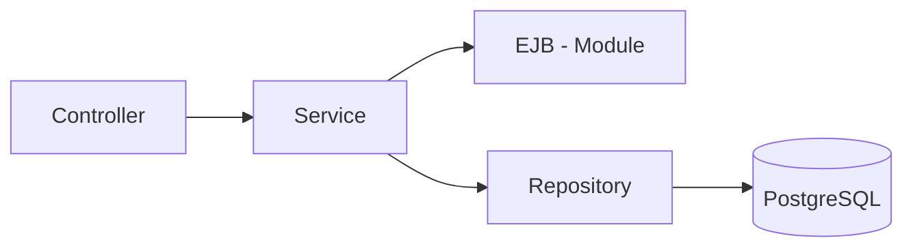

# Backend Module

## 🗂️ Índice

- [☕ Resumo do Backend Module](#-resumo-do-backend-module)
- [🛠️ Tecnologias e Arquitetura](#️-tecnologias-e-arquitetura)
- [🧩 Arquitetura do Backend Module](#-arquitetura-do-backend-module)
- [📋 Endpoints (API REST)](#-endpoints-api-rest)
- [📖 Documentação da API (Swagger)](#-documentação-da-api-swagger)
- [⚙️ Como Executar o Servidor](#️-como-executar-o-servidor)
- [💡 Configuração de Ambiente](#-configuração-de-ambiente)
- [💡 Configuração de Ambiente para Testes](#-configuração-de-ambiente-para-testes)

### ☕ Resumo do Backend Module
 
Este módulo consiste em uma API RESTful desenvolvida com o ecossistema Spring Boot, responsável pelo gerenciamento das operações de benefícios da aplicação.
A API realiza integração direta com o módulo [ejb-module](../ejb-module/), responsável pelas regras de negócio relacionadas à transferência de valores entre benefícios distintos.


### 🛠️ Tecnologias e Arquitetura

- **Java 17** & **Spring Boot 3.5.14** — Core do desenvolvimento.
- **Spring Data JPA** — Camada de persistência e comunicação com o banco de dados.
- **H2 Database / PostgreSQL** — Banco de dados relacional para armazenamento das entidades.
- **Validation (Jakarta Validator)** — Annotations (`@Valid`) para garantir que as regras de negócio dos campos sejam validadas antes de chegar ao banco.
- **Service Pattern & DTOs** — Estrutura baseada em separação de responsabilidades entre camadas (Controller, Service e Repository), utilizando DTOs para transferência segura de dados entre cliente e servidor, evitando exposição direta das entidades.
- **JUnit 5** — Framework para testes unitários.
- **Mockito** — Criação de mocks para isolamento de dependências durante os testes.
- **JaCoCo** — Geração de relatórios de cobertura de código.

### 🧩 Arquitetura do Backend Module



### 📋 Endpoints (API REST)

A API possui os seguintes recursos mapeados:

- `GET /api/v1/beneficios/todos` — Lista benefícios disponíveis com paginação e ordenação pelo ID.
- `GET /api/v1/beneficios/detalhe/{id}` — Busca detalhada de um único benefício pelo ID.
- `POST /api/v1/beneficios/novo` — Cadastra um novo benefício com nome único.
- `PUT /api/v1/beneficios/editar/{id}` — Edita os atributos do Benefício (Nome, Descrição, Valor). Não atualiza nome do benefício já existente.
- `PUT /api/v1/beneficios/transferir` —  Realiza a transferência de valores entre benefícios existentes.
- `DELETE /api/v1/beneficios/excluir/{id}` — Exclui o benefício pelo ID.


### 📖 Documentação da API (Swagger)

A API possui documentação interativa utilizando Swagger/OpenAPI permitindo visualizar e testar os endpoints diretamente pelo navegador:

[documentação da API através do swagger](http://localhost:8080/swagger-ui/index.html)


### ⚙️ Como Executar o Servidor

Abra o seu terminal dentro da pasta do backend-module e execute:

```bash
# Executar a aplicação Spring Boot
mvn spring-boot:run
```

O servidor será iniciado na porta **8080**. Os logs de inicialização e conexões serão exibidos diretamente no terminal.

- **PostgreSQL** — Banco de dados relacional robusto utilizado em ambiente de desenvolvimento para garantir a persistência e integridade dos dados da aplicação.
- **H2 Database** — Banco de dados em memória configurado exclusivamente para o ambiente de **Testes Unitários e de Integração**, garantindo isolamento completo e execuções de testes em alta velocidade, sem afetar os dados reais.


### 💡 Configuração de Ambiente

Para configurar a conexão com o banco de dados, as propriedades do Spring Data JPA e os recursos do Swagger/OpenAPI, consulte o arquivo:
[application.properties](../backend-module/src/main/resources/application.properties)

### 💡 Configuração de Ambiente para Testes

O ambiente de testes utiliza banco de dados H2 em memória, garantindo isolamento e execução segura dos testes  unitários e de integração sem interferir dos dados reais da aplicação.

As propriedades desse ambiente estão definidas no arquivo:

[application-test.properties](../backend-module/src/test/resources/application-test.properties)

