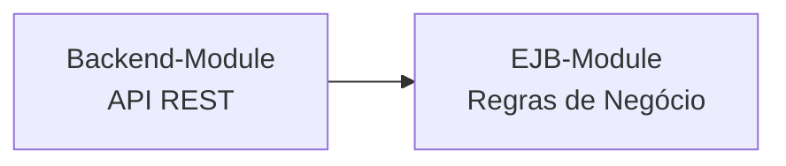
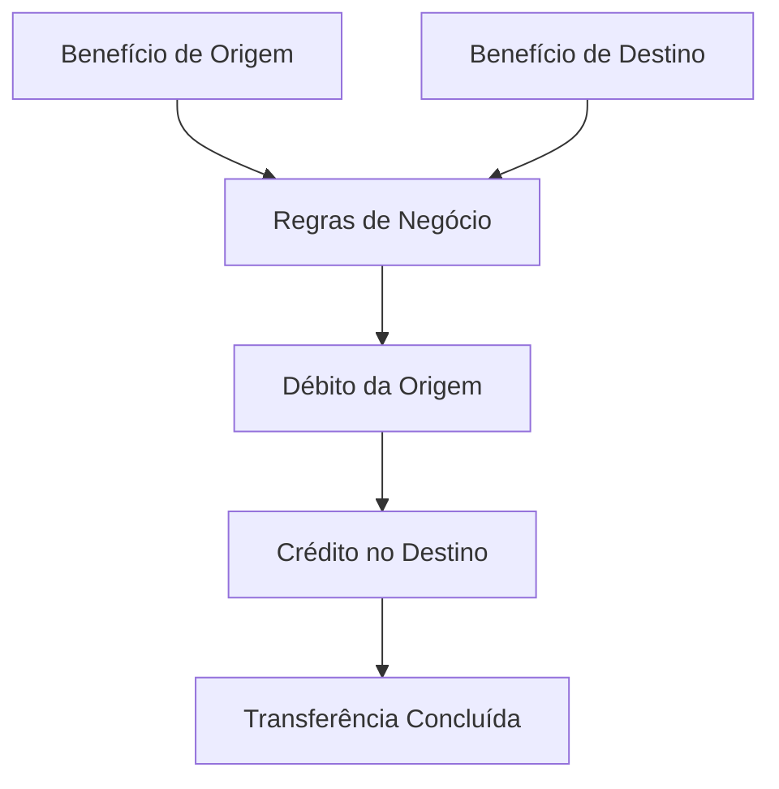

# EJB Module

## 🗂️ Índice

- [☕ Resumo do EJB Module](#-resumo-do-ejb-module)
- [📁 Estrutura do Módulo](#-estrutura-do-módulo)
- [🧩 Arquitetura do EJB Module](#-arquitetura-do-ejb-module)
- [🔄 Fluxo da Transferência entre Benefícios](#-fluxo-da-transferência-entre-benefícios)
- [🧪 Testes de Integração](#-testes-de-integração)
- [📊 Cobertura dos Testes de Integração](#-cobertura-dos-testes-de-integração)

## ☕ Resumo do EJB Module

Este módulo é responsável por centralizar as regras de negócio da aplicação, permitindo que a lógica de transferência de valores entre dois benefícios permaneça desacoplada da camada de API REST.

O módulo é utilizado como dependência interna pelo backend-module e não possui execução independente.

## 📁 Estrutura do Módulo

```text
ejb-module/
├── src/
│   └── main/
│       └── java/com/example/ejb/
│           ├── model/
│           └── service/
│
├── target/
├── .gitignore
├── pom.xml
└── README.md
```

## 🧩 Arquitetura do EJB Module




## 🔄 Fluxo da Transferência entre Benefícios



### Regras de Negócio

O módulo EJB é responsável por validar e executar a transferência de valores entre dois benefícios.

Durante a operação, as seguintes regras são aplicadas:

- Os benefícios de origem e destino devem possuir identificadores válidos.
- Não é permitido transferir valores para o mesmo benefício.
- O valor da transferência deve ser maior que zero.
- Os benefícios de origem e destino devem existir.
- O benefício de origem deve possuir saldo suficiente para a transferência.
- A operação utiliza bloqueio pessimista (`PESSIMISTIC_WRITE`) para garantir consistência dos dados em cenários concorrentes.
- Após a validação das regras, o valor é debitado do benefício de origem e creditado no benefício de destino.

## 🧪 Testes de Integração

O módulo possui testes de integração executados no `backend-module` e banco `H2` em memória, validando os cenários de transferência entre benefícios e as regras de negócio associadas.

## 📊 Cobertura dos Testes de Integração

Para instruções sobre geração do relatório, consulte a documentação do módulo [backend-module](../backend-module/README.md). P relatório de cobertura dos testes de integração, acesse:

```text
backend-module/target/site/jacoco-aggregate/index.html
```

Abra o arquivo `index.html` em um navegador para visualizar os indicadores de cobertura por pacote, classe e método.

