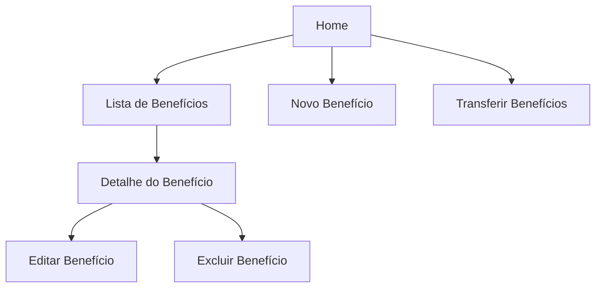

# Frontend Angular

## 🗂️ Índice

- [🅰️ Resumo do Frontend](#🅰️-resumo-do-frontend)
- [📁 Estrutura do Projeto](#-estrutura-do-projeto)
- [🔄 Fluxo da Aplicação](#-fluxo-da-aplicação)
- [⚙️ Como Executar a Aplicação](#️-como-executar-a-aplicação)

## 🅰️ Resumo do Benefício Web

Este diretório contém a aplicação frontend desenvolvida com Angular, responsável pela interface de usuário e pela comunicação com o backend do sistema de `Gestão de Benefícios`.

O Benefício Web consome os endpoints disponibilizados pelo módulo `backend-module`, permitindo operações CRUD(cadastrar,consultar, atualizar e excluir) e transferências valores entre benefícios por meio de uma interface web intuitiva e responsiva.

A aplicação atua como camada de apresentação, concentrando a experiência do usuário e a comunicação com a API REST.

## 📁 Estrutura do Projeto

```text
beneficio-web/
├── public/
├── src/
│   ├── app/
|   |     ├── core/services/
|   |     ├── features/
|   |     |    ├── beneficio
|   |     |    |    ├── beneficio-detail/
|   |     |    |    ├── beneficio-form/
|   |     |    |    └── beneficio-list/
|   |     |    ├── page/home
|   |     |    └── transferir/transferir-form/
|   |     └── shared/
|   |          ├── components/
|   |          |    ├── dialog-confirmation/
|   |          |    ├── input-area-text/
|   |          |    ├── input-moeda-real/
|   |          |    ├── input-types /
|   |          |    └── nav-bar/
|   |          ├── models/
|   |          └── pipes/
|   |               ├── ativo/
|   |               └── texto-breve/
|   |       
│   ├── index.html
│   ├── main.ts
│   ├── material-theme.scss
│   └── styles.css
├── angular.json
├── package.json
├── tsconfig.json
└── README.md
```

## 🔄 Fluxo da Aplicação



## ⚙️ Como Executar a Aplicação

As instruções completas para instalação, execução, build e testes da aplicação do Angular estão disponíveís para consulta no [beneficio-web](./beneficio-web/README.md).

## 🧪 Testes Unitários

A aplicação utiliza o **Vitest** como framework para execução dos testes unitários dos componentes, serviços, pipes e demais elementos da aplicação Angular.

Os testes são executados em ambiente `jsdom`, simulando o comportamento do navegador durante a execução. A configuração atual utiliza o navegador `Chromium`, que é iniciado automaticamente durante a execução dos testes.

## 📊 Cobertura dos Testes Unitários

A cobertura de código é gerada automaticamente pelo **Vitest Coverage** utilizando o provider `v8`, permitindo analisar a cobertura das funcionalidades implementadas na aplicação.

Os relatórios são gerados nos formatos:

- Texto (`text`)
- HTML (`html`)
- JSON (`json`)
- Clover (`clover`)

Este é o arquivo de configuração dos testes do `Vitest`:
[vitest.config.ts](./beneficio-web/vitest.config.ts)

Para habilitar esse recurso no `angular.json` para cobertura dos testes:
```json
"test": {
          "builder": "@angular/build:unit-test",
          "options": {
            "coverage": true,
            "coverageInclude": [],
            "runnerConfig": "vitest.config.ts",
            "browsers": [
              "chromium"
            ]
          }
        }
```

A análise de cobertura considera os arquivos da aplicação localizados em `src/app`, desconsiderando arquivos de configuração, arquivos de teste e modelos utilizados apenas para tipagem.

Após a execução dos testes, o relatório HTML de cobertura pode ser consultado no diretório:

```text
coverage/index.html
```

Também é possível abrir direto no arquivo `index.html` em um navegador para visualizar os indicadores de cobertura por arquivo, função, linha e branch.
